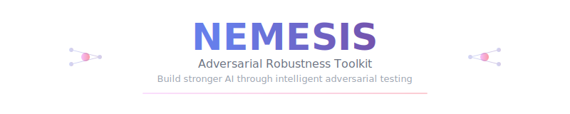

<p align="center">
  
</p>

## 🏛️ In Greek mythology, Nemesis was the goddess of retribution

In machine learning, **Nemesis** is your model's personalized adversary - a powerful toolkit that discovers vulnerabilities through battle, making your AI stronger with each confrontation.

Like the ancient goddess who brought divine justice to those who needed humbling, Nemesis challenges your models to grow beyond their limitations, forging unbreakable strength through adversarial fire.

## ⚡ Quick Start

```python
from nemesis import summon_nemesis

# Your model faces its nemesis
nemesis = summon_nemesis(your_model)
weaknesses = nemesis.find_weakness()
armor = nemesis.forge_armor()

# The eternal battle begins
stronger_model = nemesis.eternal_battle()
```

## 🌟 Features

- 🗡️ **20+ Attack Strategies** - From whispers to storms
- 🛡️ **15+ Defense Mechanisms** - Shields and armor for every threat  
- ⚔️ **Automated Battles** - Let your model face its nemesis
- 📊 **Battle Analytics** - Track growth and victories
- 🏆 **Hall of Legends** - Compare your model's journey
- 🏛️ **Arena System** - Epic tournaments and trials
- 🎭 **Nemesis Personalities** - Adaptive, cunning, relentless adversaries
- ⚡ **Evolution System** - Models grow stronger through battle
- 🔮 **Mythological Interface** - Epic theming throughout

## 🏛️ Philosophy

Every model needs a nemesis. Through adversarial confrontation, weaknesses are revealed, defenses are forged, and true robustness emerges. Nemesis doesn't just test your models - it transforms them into legends.

> *"Iron sharpens iron, and one model sharpens another"*

## 🚀 Installation

```bash
git clone https://github.com/seshanpillay25/nemesis.git
cd nemesis
pip install -e .
```

## 🧪 Testing Your Models Locally

Nemesis supports testing with various local model setups, including Ollama, local transformers, and custom models. Here's how to get started with different scenarios:

### 🦙 Testing with Ollama

[Ollama](https://ollama.ai) makes it easy to run large language models locally. Nemesis can test these models for robustness:

```python
import requests
from nemesis import summon_nemesis
from nemesis.models import OllamaWrapper

# Wrap your Ollama model for Nemesis testing
class OllamaModel:
    def __init__(self, model_name="llama2", base_url="http://localhost:11434"):
        self.model_name = model_name
        self.base_url = base_url
    
    def predict(self, text_input):
        response = requests.post(
            f"{self.base_url}/api/generate",
            json={"model": self.model_name, "prompt": text_input, "stream": False}
        )
        return response.json()["response"]

# Create and test your Ollama model
ollama_model = OllamaModel("llama2")
nemesis = summon_nemesis(ollama_model, name="LlamaBane")

# Test for prompt injection vulnerabilities
weaknesses = nemesis.find_weakness(attack_budget=50)
print(f"Found {len(weaknesses)} potential vulnerabilities")
```

### 🤗 Hugging Face Transformers

Test local transformer models with full GPU acceleration:

```python
from transformers import AutoTokenizer, AutoModelForSequenceClassification
from nemesis import summon_nemesis

# Load a local BERT model
tokenizer = AutoTokenizer.from_pretrained("bert-base-uncased")
model = AutoModelForSequenceClassification.from_pretrained("bert-base-uncased")

# Wrap for text classification testing
class HuggingFaceWrapper:
    def __init__(self, model, tokenizer):
        self.model = model
        self.tokenizer = tokenizer
    
    def predict(self, text):
        inputs = self.tokenizer(text, return_tensors="pt", padding=True, truncation=True)
        outputs = self.model(**inputs)
        return outputs.logits

wrapped_model = HuggingFaceWrapper(model, tokenizer)
nemesis = summon_nemesis(wrapped_model, name="BertNemesis")

# Test robustness against text attacks
armor = nemesis.forge_armor(strategy="robust")
protected_model = armor.apply(wrapped_model)
```

### 🖼️ Computer Vision Models

Test your local image classification models:

```python
import torch
import torchvision.models as models
from nemesis import summon_nemesis

# Load a pretrained ResNet
model = models.resnet18(pretrained=True)
model.eval()

# Create nemesis for image attacks
nemesis = summon_nemesis(model, name="VisionBane")

# Test with sample images
import torchvision.transforms as transforms
from PIL import Image

# Prepare test image
transform = transforms.Compose([
    transforms.Resize(224),
    transforms.CenterCrop(224),
    transforms.ToTensor(),
])

# Load and test an image
test_image = Image.open("path/to/your/image.jpg")
input_tensor = transform(test_image).unsqueeze(0)

# Find vulnerabilities
weaknesses = nemesis.find_weakness(attack_budget=100)

# Generate adversarial examples
from nemesis.attacks import Storm
storm = Storm(model)
adversarial_result = storm.unleash(input_tensor, epsilon=0.03)

if adversarial_result.success:
    print("Model fooled! Adversarial attack succeeded.")
    # Visualize the attack
    nemesis.visualize_attack(adversarial_result)
```

### 🔬 Custom Model Testing

Test any custom PyTorch or TensorFlow model:

```python
import torch.nn as nn
from nemesis import summon_nemesis

# Your custom model
class CustomMLP(nn.Module):
    def __init__(self, input_size=784, hidden_size=128, num_classes=10):
        super().__init__()
        self.fc1 = nn.Linear(input_size, hidden_size)
        self.fc2 = nn.Linear(hidden_size, hidden_size)
        self.fc3 = nn.Linear(hidden_size, num_classes)
        self.relu = nn.ReLU()
        self.dropout = nn.Dropout(0.2)
    
    def forward(self, x):
        x = x.view(x.size(0), -1)  # Flatten
        x = self.relu(self.fc1(x))
        x = self.dropout(x)
        x = self.relu(self.fc2(x))
        x = self.fc3(x)
        return x

# Load your trained model
model = CustomMLP()
model.load_state_dict(torch.load("your_model.pth"))
model.eval()

# Create nemesis with different personalities
personalities = ["aggressive", "cunning", "adaptive"]

for personality in personalities:
    nemesis = summon_nemesis(model, personality=personality)
    report = nemesis.find_weakness()
    print(f"{personality} nemesis found {len(report)} vulnerabilities")
```

### 🏁 Quick Testing Script

Create a `test_model.py` script for rapid model testing:

```python
#!/usr/bin/env python3
"""
Quick model robustness testing script
Usage: python test_model.py --model-path your_model.pth --data-path test_data/
"""

import argparse
import torch
from nemesis import summon_nemesis
from nemesis.arena import Arena

def test_model_robustness(model_path, test_data_path=None):
    """Test a model's robustness quickly."""
    
    # Load your model
    model = torch.load(model_path)
    model.eval()
    
    print("🏛️ Nemesis Model Testing Suite 🏛️")
    print("=" * 50)
    
    # Create arena for comprehensive testing
    arena = Arena("Robustness Testing Arena")
    
    # Battle with different nemesis personalities
    personalities = ["aggressive", "cunning", "adaptive", "relentless"]
    
    for personality in personalities:
        print(f"\n⚔️ Testing against {personality} nemesis...")
        
        battle_result = arena.legendary_battle(
            model=model,
            rounds=5,
            nemesis_personality=personality,
            evolution_enabled=True
        )
        
        print(f"✅ Robustness Score: {battle_result.final_robustness_score:.3f}")
        print(f"📈 Improvement: {battle_result.improvement_gained:.3f}")
    
    # Show final statistics
    legends = arena.hall_of_legends()
    
    return legends

if __name__ == "__main__":
    parser = argparse.ArgumentParser(description="Test model robustness with Nemesis")
    parser.add_argument("--model-path", required=True, help="Path to your model file")
    parser.add_argument("--data-path", help="Path to test data (optional)")
    
    args = parser.parse_args()
    test_model_robustness(args.model_path, args.data_path)
```

### 🐳 Docker Testing

Test models in isolated Docker environments:

```dockerfile
# Dockerfile for Nemesis testing
FROM python:3.9-slim

WORKDIR /app

# Install Nemesis
COPY requirements.txt .
RUN pip install -r requirements.txt

# Copy your model and test scripts
COPY your_model.pth .
COPY test_script.py .

# Run robustness tests
CMD ["python", "test_script.py", "--model-path", "your_model.pth"]
```

```bash
# Build and run
docker build -t nemesis-test .
docker run -v $(pwd)/results:/app/results nemesis-test
```

### 📊 Batch Model Testing

Test multiple models automatically:

```python
import os
from pathlib import Path
from nemesis.arena import Arena

def batch_test_models(model_directory):
    """Test all models in a directory."""
    
    arena = Arena("Batch Testing Arena")
    results = {}
    
    model_files = Path(model_directory).glob("*.pth")
    
    for model_path in model_files:
        print(f"Testing {model_path.name}...")
        
        try:
            model = torch.load(model_path)
            model.eval()
            
            # Quick robustness test
            battle_result = arena.legendary_battle(
                model=model,
                rounds=3,
                battle_name=f"Test: {model_path.name}"
            )
            
            results[model_path.name] = {
                'robustness_score': battle_result.final_robustness_score,
                'improvement': battle_result.improvement_gained,
                'status': 'success'
            }
            
        except Exception as e:
            results[model_path.name] = {
                'status': 'failed',
                'error': str(e)
            }
    
    return results

# Run batch testing
results = batch_test_models("./models/")
print("📊 Batch Testing Results:")
for model_name, result in results.items():
    if result['status'] == 'success':
        print(f"✅ {model_name}: {result['robustness_score']:.3f} robustness")
    else:
        print(f"❌ {model_name}: {result['error']}")
```

### 🔧 Troubleshooting Local Testing

Common issues and solutions:

```python
# Handle CUDA/CPU compatibility
import torch
device = torch.device("cuda" if torch.cuda.is_available() else "cpu")
model = model.to(device)

# Memory management for large models
torch.cuda.empty_cache()  # Clear GPU memory

# Handle different input formats
def normalize_inputs(inputs):
    """Normalize inputs for consistent testing."""
    if isinstance(inputs, str):
        # Text input
        return inputs
    elif hasattr(inputs, 'shape'):
        # Tensor input
        return inputs.float()
    else:
        # Convert to tensor
        return torch.tensor(inputs, dtype=torch.float32)
```

## 🗡️ Attack Arsenal

### Evasion Attacks
- **Whisper** (FGSM) - Subtle perturbations that slip past defenses
- **Storm** (PGD) - Powerful iterative attacks that build like thunder  
- **Shapeshifter** (C&W) - Optimized transformations that bend reality
- **Mirage** (DeepFool) - Minimal perturbations that deceive the eye
- **Chaos** (AutoAttack) - Ensemble mayhem that unleashes multiple strategies

### Poisoning Attacks  
- **Trojan** - Backdoor attacks that hide like the Trojan Horse
- **Corruption** - Label flipping that spreads like plague

### Extraction Attacks
- **MindThief** - Model stealing through clever queries
- **Oracle** - Query-based extraction that reveals hidden knowledge

## 🛡️ Defense Arsenal

### Shields (Preprocessing)
- **Aegis** - Input purification that cleanses corruption
- **Barrier** - Adversarial detection that reveals threats

### Armor (Training-time)
- **Fortitude** - Adversarial training that builds strength through battle
- **Resilience** - Defensive distillation that creates natural resistance  
- **Immunity** - Certified defenses with mathematical guarantees

## ⚔️ Epic Battles

### Face Your Nemesis
```python
from nemesis import Nemesis, NemesisPersonality

# Summon your model's greatest adversary
my_nemesis = Nemesis(model, name="DarkMirror", personality=NemesisPersonality.RELENTLESS)

# Discover vulnerabilities
weaknesses = my_nemesis.find_weakness()
print(f"Nemesis found {len(weaknesses)} weaknesses")

# Forge defenses
armor = my_nemesis.forge_armor(strategy="adaptive")
protected_model = armor.apply(model)

# Eternal battle for ultimate strength
champion = my_nemesis.eternal_battle(rounds=100, evolution=True)
```

### Arena Tournaments
```python
from nemesis.arena import Arena

# Enter the sacred arena
arena = Arena("Colosseum of AI")

# Epic battle between model and nemesis
battle_result = arena.legendary_battle(
    model=your_model,
    rounds=10,
    nemesis_personality="adaptive"
)

# Tournament of champions
tournament_results = arena.tournament([model1, model2, model3])

# View the Hall of Legends
legends = arena.hall_of_legends()
```

### Nemesis Personalities

Each nemesis has a unique fighting style:

```python
# Aggressive - Fast, powerful attacks
nemesis = Nemesis(model, personality=NemesisPersonality.AGGRESSIVE)

# Cunning - Clever, minimal perturbations  
nemesis = Nemesis(model, personality=NemesisPersonality.CUNNING)

# Adaptive - Learns and evolves strategies
nemesis = Nemesis(model, personality=NemesisPersonality.ADAPTIVE)

# Relentless - Never-ending pressure
nemesis = Nemesis(model, personality=NemesisPersonality.RELENTLESS)

# Chaotic - Unpredictable combinations
nemesis = Nemesis(model, personality=NemesisPersonality.CHAOTIC)
```

## 🏛️ Advanced Usage

### Custom Attack Strategies
```python
from nemesis.attacks import Whisper, Storm, Chaos

# Individual attacks
whisper = Whisper(model)
result = whisper.unleash(input_data, epsilon=0.1)

# Ensemble chaos
chaos = Chaos(model)
devastating_result = chaos.unleash(input_data, targeted=True, target_class=5)
```

### Defense Combinations
```python
from nemesis.defenses import Aegis, Fortitude, DefenseArmor

# Layer multiple defenses
armor = DefenseArmor(model, strategy="robust")
fortified_model = armor.apply(model)

# Test protection
protection_report = armor.test_protection(test_inputs, attacks=[whisper, storm])
```

### Battle Analytics
```python
# Detailed weakness analysis
report = nemesis.find_weakness(attack_budget=5000)
for vulnerability in report.vulnerabilities:
    print(f"Attack: {vulnerability['attack_type']}")
    print(f"Success Rate: {vulnerability['success_rate']:.2f}")
    print(f"Severity: {vulnerability['severity']}")

# Model evolution tracking
for round_num, history in enumerate(nemesis.battle_history):
    print(f"Round {round_num}: {history['weaknesses_found']} weaknesses found")
    print(f"Evolution Level: {history['evolution_level']}")
```

## 📊 Robustness Evaluation

```python
# Comprehensive robustness assessment
from nemesis.attacks import Chaos

chaos = Chaos(model)
robustness_report = chaos.analyze_model_robustness(
    test_inputs=test_dataset,
    epsilon=0.1
)

print(f"Attack Success Rate: {robustness_report['attack_success_rate']:.2f}")
print(f"Robustness Score: {robustness_report['robustness_score']:.2f}")
print(f"Average Queries: {robustness_report['average_queries']:.0f}")
```

## 🏆 Model Zoo & Examples

Nemesis comes with pre-trained adversaries for common architectures:

```python
# Load pre-trained nemesis for ResNet
nemesis = summon_nemesis(resnet_model, name="ResNetBane")

# Use community-trained adversaries
from nemesis.zoo import load_nemesis
community_nemesis = load_nemesis("bert-crusher-v2")
```

## 🎭 Visualization & Monitoring

```python
# Battle visualization
nemesis.visualize_battle_scars(input_image)

# Real-time battle monitoring
with nemesis.battle_monitor() as monitor:
    result = nemesis.eternal_battle(rounds=50)
    monitor.save_battle_replay("epic_battle.gif")

# Arena statistics
arena.plot_tournament_results()
arena.export_battle_analytics("arena_stats.csv")
```

## ⚙️ Configuration

Create a `nemesis_config.yaml` for custom setups:

```yaml
nemesis:
  default_personality: "adaptive"
  battle_rounds: 10
  evolution_enabled: true
  
arena:
  name: "Custom Arena"
  auto_save: true
  replay_battles: true

attacks:
  budget: 1000
  epsilon_range: [0.01, 0.3]
  
defenses:
  auto_evolve: true
  protection_level: "high"
```

## 🌐 Framework Support

Nemesis works seamlessly with:

- **PyTorch** - Full support for all features
- **TensorFlow** - Complete compatibility  
- **JAX** - Experimental support
- **Scikit-learn** - Basic adversarial testing
- **Hugging Face** - Transformer model support

## 📚 Research & Citations

Nemesis implements and extends many seminal works in adversarial ML:

### Implemented Methods

- **FGSM** - Goodfellow et al. (2014)
- **PGD** - Madry et al. (2017)  
- **C&W** - Carlini & Wagner (2017)
- **AutoAttack** - Croce & Hein (2020)
- **Randomized Smoothing** - Cohen et al. (2019)
- And many more...

## 🛡️ Security & Ethics

Nemesis is designed for:
- ✅ Improving model robustness
- ✅ Academic research
- ✅ Security testing with permission
- ✅ Educational purposes

Not intended for:
- ❌ Malicious attacks
- ❌ Unauthorized testing
- ❌ Harmful applications

## 🏛️ Acknowledgments

Nemesis stands on the shoulders of giants:

- The adversarial ML research community
- Open source ML frameworks
- Greek mythology for epic inspiration

---

**⚔️ May your models be ever stronger ⚔️**